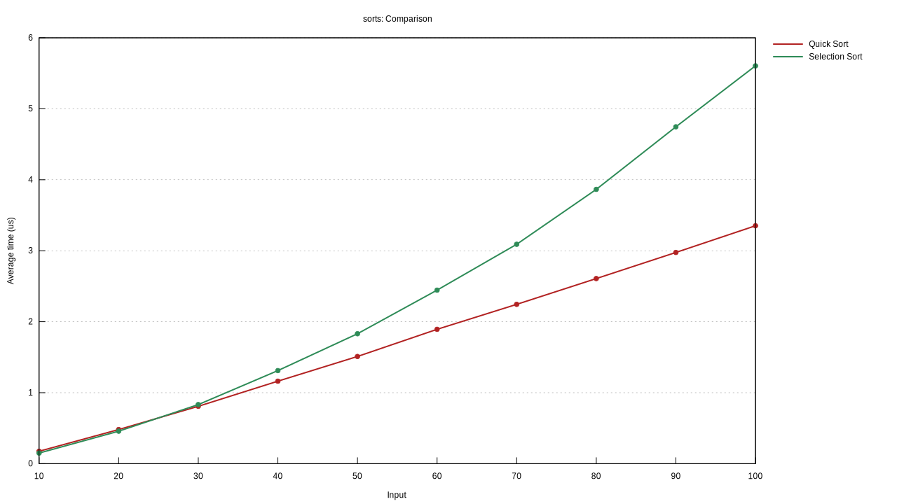
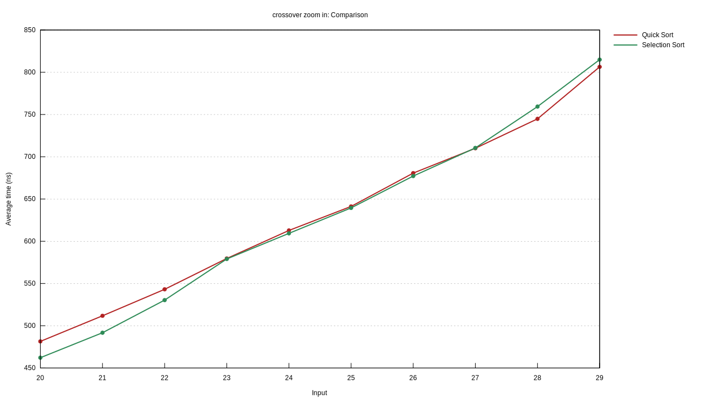
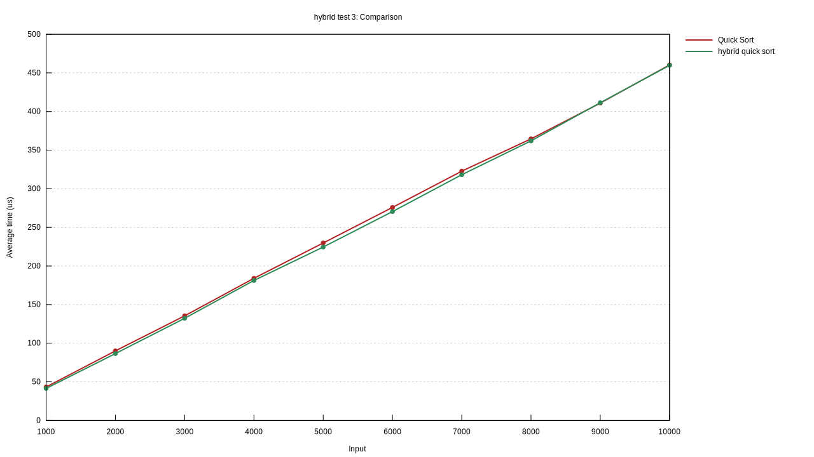
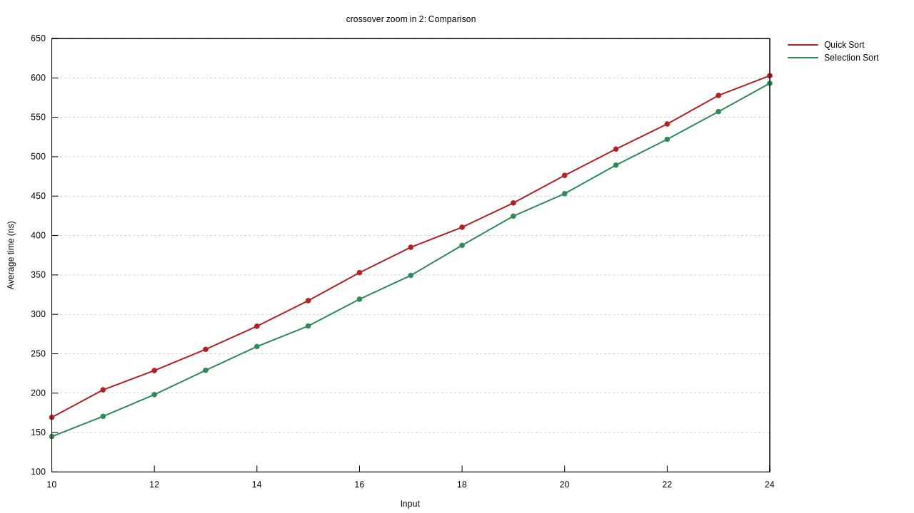
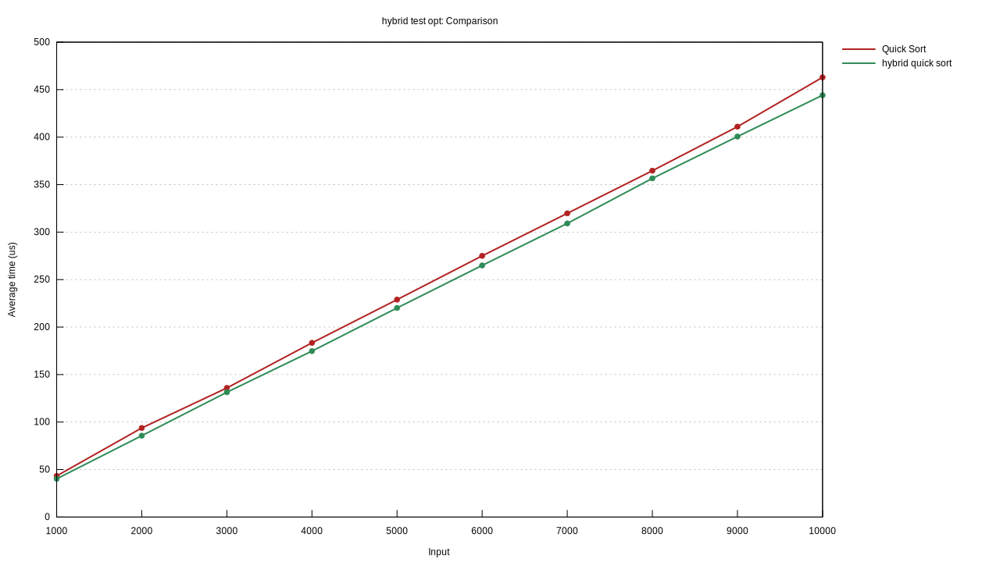

## Summary

In this benchmark we compared the averaged runtimes of the selection sort, and the quick sort, over various input sizes of randomly generated arrays in order to find the crossover point at which quick sort(using Hoare's partition scheme) consistently outperformed the selection sort, in order to make a hybrid sort.

each input size was tested over 10^2-10^3 iterations using the [criterion library](https://github.com/bheisler/criterion.rs)

## Initial analysis

first we compared the two sorting algorithms over inputs sizes 10,20,30..100

we then repeated the test iterating over the input sizes 21...30

from this we can see that the crossover point, the point at which quick sort consistently outperforms the selection sort is 28, however 23-27 the performance of these two algorithms seems to be roughly the same. With these results I chose 22 as the point where the hybrid algorithm would transition between selection and quick

as demonstrated using this as the switch point led to overall better performance in practice in comparison to the quick sort

## Further analysis

This is outside the scope of the assignment, but I had tried to use 21 rather than 22 seeing as how the gap was larger between the performance of the selection and quick sort, but this led to negligible gains, and may have degraded the performance in one set of iterations. curious as to what a better switch value might be, I compared the selection sort and quick sort from 10..25

using this, I then compared used 17 as the switch point in the hybrid algorithm and reran the experiment.

this seemed to yield better performance gains when compared to a larger switch value of 22

## System Info

- **OS** : fedora 35
- **kernel** : `5.16.9-200.fc35.x86_64`
- **rustc version**: 1.58.1
- **cpu**: AMD Ryzen 7 2700 Eight-Core Processor
  - max MHz:         3200.0000
  - min MHz:         1550.0000

## Source Code
